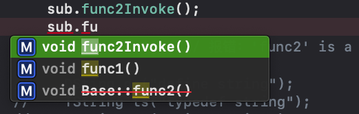

## using 关键字使用
using 是一个 C++ 关键字，见到最多的应用估计是 `using namespace std;`

作用列表:
1. 配合命名空间，对命名空间权限进行管理。
```
using namespace std; // 释放整个命名空间到当前作用域
using std::cout; // 释放某个变量到当前作用域
```
2. 对类型进行重命名，作用和 `typedef` 相似，但是逻辑上更加直观。
```
#include <iostream>
using namespace std;

// 定义类型别名
#define DSting std::string // 不建议使用
typedef std::string TString; // 使用 typedef 的方式
using UString = std::string; // 使用 using typeName_Self = stdTypeName;
// 定义函数指针
typedef void (*tFunc)(string);
using uFunc = void (*)(string);

void tempFunc(string parm) {
    std::cout << "🎉🎉" << parm << std::endl;
}

int main(int argc, const char * argv[]) {
    // insert code here...
    DSting ds("define string");
    TString ts("typedef string");
    UString us("using string");
    
    tFunc funcPtr = tempFunc;
    (*funcPtr)(ts);
    
    uFunc funcPtr2 = tempFunc;
    (*funcPtr2)(us);
    (*funcPtr2)(ds);
}
// 打印:
🎉🎉typedef string
🎉🎉using string
🎉🎉define string
```
3. 声明一个模版类名。
```
template <typename N>
class TLClass {
public:
    TLClass(N parm): mV(parm) {}
    ~TLClass(){}
    
    void func() {
        std::cout << "🎉🎉🎉 " << mV << std::endl;
    }
private:
    N mV;
};

using UTLCass = TLClass<int>;

int main(int argc, const char * argv[]) {
    // insert code here...

    UTLCass cls(20);
    cls.func();
}
// 打印:
🎉🎉🎉 20
```
4. 在继承体系中，改变部分接口的继承权限。比如我们需要私有继承一个基类，然后又想将基类中的某些 `public` 接口在子类对象实例化后对外开放直接使用。
```
class Base {
public:
    Base(){}
    ~Base(){};
    void func1() {
        std::cout << "1⃣️ func1 被调用" << std::endl;
    }
    
    void func2() {
        std::cout << "2⃣️ func2 被调用" << std::endl;
    }
};

class Sub: private Base {
public:
    using Base::func1;
    
    void func2Invoke() {
        // Base 的 func2 函数只能在 Sub 定义内部使用，
        // 外界只能通过 Sub 的 func2Invoke 来间接调用 func2 函数
        this->func2();
    }
};

int main(int argc, const char * argv[]) {
    // insert code here...
    Sub sub;
    sub.func1();
    sub.func2Invoke();
    // sub.func2(); // 报错：'func2' is a private member of 'Base'
}
// 打印：
1⃣️ func1 被调用
2⃣️ func2 被调用
```


[参考链接🔗](https://www.cnblogs.com/wangkeqin/p/9339862.html)

